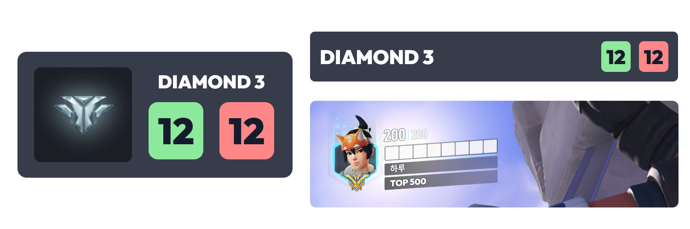

# 오버워치 2 레이아웃 for NodeCG
[NodeCG](https://github.com/nodecg/nodecg)로 이용해서 여러분의 방송 화면을 깔끔하고 더욱 유동적이게 만들어주는 레이아웃 입니다.

## 기능
* 오버워치 2 경쟁전 전적 표시 오버레이
  * 기본 스킨
  * 미니멀 스킨
  * UI 스킨
  
## 설치 방법
해당 내용은 오버워치 2 레이아웃 설치 방법이며, NodeCG 설치 방법은 [이쪽](https://www.nodecg.dev/docs/installing)에서 확인해 주시기 바랍니다.

### 간단 설치
Releases 페이지 들어가서 `overwatch2-layout.zip` 파일을 다운로드 해 주고, `nodecg/bundles` 폴더에 압축 풀어주시면 레이아웃 설치 성공입니다.

### 명령어 활용
명령어로도 간단하게 설치 할 수 있습니다
```
cd nodecg/bundles
git clone --branch https://github.com/haruchanheart/overwatch2-layout.git
```

## 사용 방법
### 방송 화면에 추가
NodeCG 접속 후 Graphics 메뉴에서 링크를 복사합니다. 그리고 OBS에서 브라우저를 추가해 링크를 붙여넣어서 적용시키면 됩니다.

### 오버워치 2 경쟁전 전적 표시 오버레이

Graphics 메뉴로 가면 `overwatch2.html`, `overwatch2_minimal.html`와 `overwatch2_ui.html` 파일을 볼 수 있습니다.
* `overwatch2.html`은 경쟁전 랭크 아이콘과 랭크 이름, 전적이 표시됩니다.
* `overwatch2_minimal.html`은 랭크 아이콘이 보이지 않는 대신 랭크 이름과 전적이 표시됩니다.
* `overwatch2_ui.html`은 오버워치 2의 UI와 비슷하게 제작되어 랭크 아이콘과 랭크 이름이 표시됩니다.

이제 Workspace 메뉴로 들어가면 오버워치 점수 패널이란 창을 볼 수 있고 여기서 각각 내용에 맞게 수정해 주시면 됩니다.

## 사용된 라이브러리
* [Materialize CSS](https://materializecss.com)
* [Outfit 글꼴](https://outfit.io)
